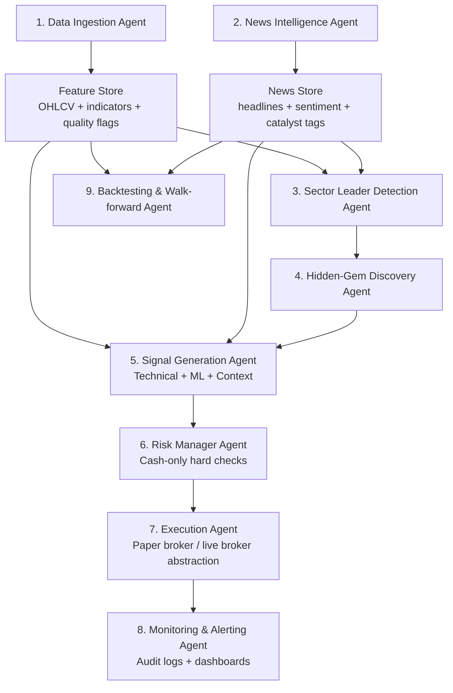

# Agentic Cash-Only AI Equities Trading System (Research MVP)

> **Important**: This project is for research/engineering only, not investment advice, and profitability is not guaranteed.
> Defaults are **paper trading** with strict **cash-only** guardrails. Live trading requires explicit config enablement.

## 1) Full architecture proposal



### Agent responsibilities (structured I/O)
- **Data ingestion agent**: input `symbols,timeframe,lookback`; output OHLCV+indicators+quality metadata.
- **News intelligence agent**: input `symbol,date_range`; output normalized articles + sentiment + catalyst tags.
- **Sector leader detection agent**: input leader universe; output ranked current leaders.
- **Hidden-gem discovery agent**: input leaders + candidate universe; output scored laggards with explanations.
- **Signal generation agent**: input features + catalyst + gem score; output long-only candidate signals with confidence.
- **Risk manager agent**: input signal + account/broker state; output approve/reject + reason + max safe size.
- **Execution agent**: input approved order; output broker ack/fill status.
- **Monitoring agent**: input all decision events; output logs/metrics/rejection reason trails.
- **Backtesting/evaluation agent**: input historical features/signals; output strategy metrics + benchmark comparison.

## 2) Step-by-step implementation plan
1. Create config schema and safety defaults (paper mode, cash-only limits).
2. Build market data connector with multi-timeframe OHLCV and technical features.
3. Add news provider abstraction + sentiment scoring.
4. Implement sector leader scoring over AI-focused universe.
5. Implement hidden-gem ranking model (similarity, AI exposure, lag, valuation, sentiment, liquidity).
6. Implement signal stack (technical rules + ML ranker + fusion).
7. Implement risk engine with hard guardrails and circuit-breaker blocks.
8. Implement broker abstraction with paper broker first, live broker adapter separate.
9. Implement orchestrator to run agent pipeline end-to-end.
10. Add audit logs, backtest engine, metrics, and unit tests.
11. Validate in paper mode before any live mode enablement.

## 3) Recommended project structure

```text
ai_trading_agent/
  agents/orchestrator.py
  backtest/{engine.py,metrics.py}
  broker/{base.py,paper.py,alpaca.py}
  config/{schema.py,loaders.py}
  data/{market_data.py,news_data.py}
  discovery/{sector_leaders.py,hidden_gems.py}
  monitoring/audit_logger.py
  risk/engine.py
  signals/{technical.py,ml_ranker.py,signal_fusion.py}
  core.py
configs/
  config.example.yaml
  watchlist.example.yaml
tests/
  test_risk_engine.py
  test_hidden_gems.py
main.py
```

## 4) Detailed Python MVP code
- See code under `ai_trading_agent/` and `main.py`.
- Key design choices:
  - **Long-only, cash-only** from risk layer and paper broker accounting.
  - **No margin**: buying power bound to available cash.
  - **Pre-trade validation** always run before order placement.
  - **Explainability**: each approved/rejected action logged with reasons.

## 5) Sample hidden-gem scoring model
Final score per symbol:

`0.25*similarity + 0.20*ai_exposure + 0.20*news_sentiment + 0.15*relative_price_lag + 0.10*valuation_gap + 0.10*liquidity`

Where:
- `similarity`: business adjacency to top AI leaders.
- `ai_exposure`: estimated revenue/narrative linkage to AI spend cycle.
- `news_sentiment`: normalized headline sentiment.
- `relative_price_lag`: lag vs AI benchmark (e.g., SOXX).
- `valuation_gap`: lower valuation vs peer leaders.
- `liquidity`: tradability proxy from recent dollar volume.

## 6) Backtesting module
- Includes fees/slippage modeling, position transitions, equity curve, and metrics:
  - CAGR/total return
  - Sharpe/Sortino
  - max drawdown
  - win rate/profit factor
  - turnover/exposure

## 7) Broker integration (paper first)
- `Broker` interface standardizes `get_account`, `is_tradable`, `place_order`.
- `PaperBroker` is default for safe testing.
- `AlpacaBroker` is isolated adapter for live/paper API environments.

## 8) Risk engine enforcing cash-only
Risk checks implemented before any order:
- cash-only sizing
- no margin/no borrowing
- max trade % and max symbol % caps
- daily loss stop / portfolio drawdown stop
- max open positions
- liquidity minimum
- market-hours gate
- circuit breaker on uncertainty/data quality

If any check fails -> **skip trade** with logged reason.

## 9) Example configs and usage

```bash
pip install -e .[dev]
python main.py
pytest -q
```

- Edit `configs/config.example.yaml` for limits/mode.
- Edit `configs/watchlist.example.yaml` for leaders and adjacent candidates.
- Keep `execution.allow_live=false` until extensive paper validation is complete.

## 10) Future improvements
- Add richer fundamentals (SEC filings, segment revenue NLP, estimate revisions).
- Add robust walk-forward retraining and nested CV.
- Add portfolio optimizer with correlation/risk parity constraints.
- Add real-time market-hours and exchange calendar integration.
- Add dashboard (Streamlit/Grafana) for PnL/risk/rejections.
- Add richer news stack (earnings transcript embeddings + event extraction).
- Add data quality scoring and stale-feed detection alarms.

## Compliance/Safety reminders
- Never enable margin or leverage in broker account settings.
- Never short in this strategy profile.
- Never submit orders that can drive cash negative.
- Keep live mode behind explicit manual switch + approvals.
